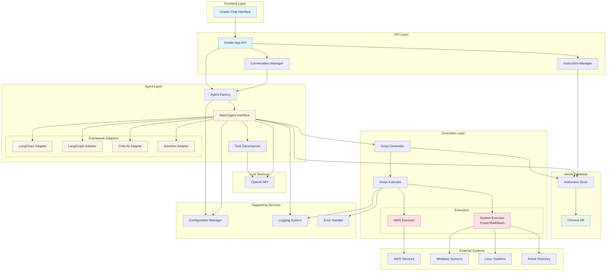
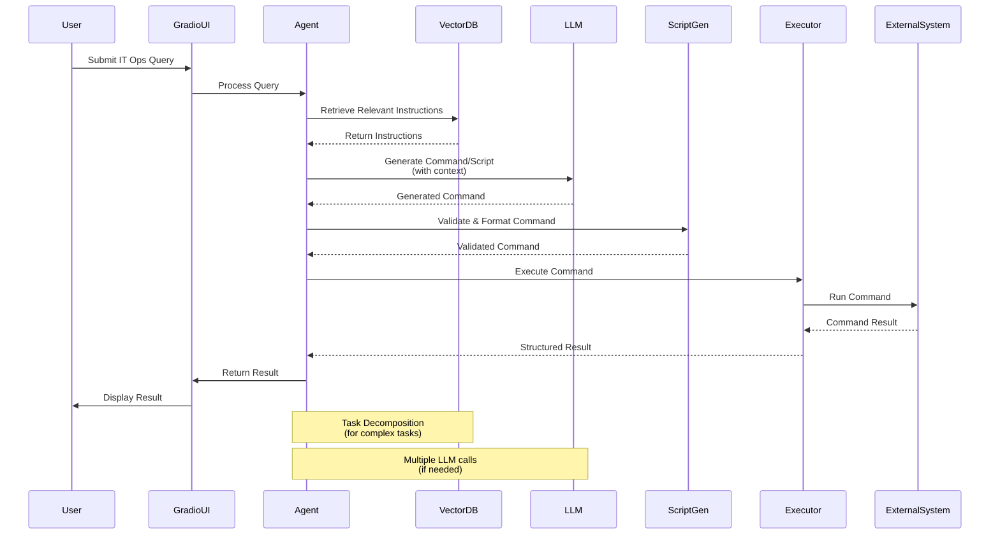
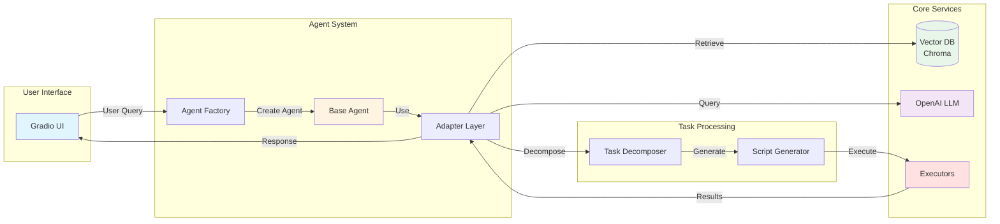
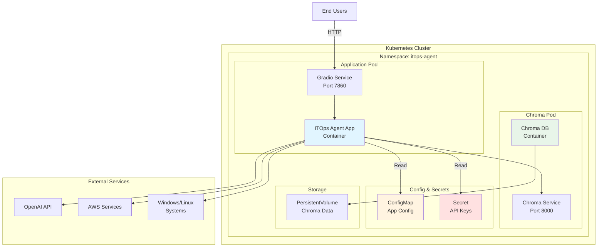

# IT Ops Agent System - Iterative Implementation Plan

## Overview

This plan breaks down the IT Ops Agent System into iterative phases, each delivering a working, testable increment that builds upon the previous phase. Each phase can be demonstrated and validated before moving to the next.

### IT Ops Tasks Scope

The system will handle common IT operational tasks. The initial set includes 23+ task types:

**Access Management:**
- `password_reset` - Reset user passwords (AWS IAM, Active Directory, local accounts)
- `account_locked` - Unlock user accounts
- `jira_access_request` - Grant Jira access
- `access_jira` - Troubleshoot Jira access issues
- `shared_drive_access` - Grant shared drive access

**Application Issues:**
- `outlook_sync` - Troubleshoot Outlook synchronization
- `outlook_not_syncing` - Fix Outlook sync problems
- `teams_not_signing_in` - Resolve Teams authentication issues
- `zoom_audio_not_working` - Fix Zoom audio problems
- `application_crashing` - Troubleshoot application crashes
- `software_install_request` - Handle software installation requests

**Hardware Issues:**
- `laptop_overheating` - Diagnose and resolve overheating
- `monitor_not_detected` - Fix monitor detection issues
- `printer_not_working` - Troubleshoot printer problems
- `no_sound_windows` - Fix Windows audio issues

**Network Issues:**
- `vpn_troubleshooting` - General VPN troubleshooting
- `vpn_not_connecting` - Fix VPN connection problems
- `wifi_not_working` - Resolve WiFi connectivity issues

**System Issues:**
- `laptop_running_slow` - Diagnose and optimize slow systems
- `blue_screen_error` - Troubleshoot BSOD errors
- `excel_freezing` - Fix Excel freezing issues
- `onedrive_sync_issue` - Resolve OneDrive sync problems

**Email Issues:**
- `email_delivery_failed` - Troubleshoot email delivery failures

**Extensibility:** The system should be easily extensible to handle additional IT ops tasks as needed.

### Testing Philosophy

- **Test-Driven Development**: Tests are set up in Phase 1 and written alongside each component
- **Success Criteria Embedded**: Each component has specific success criteria and corresponding tests
- **Incremental Validation**: Components are tested immediately after implementation
- **Integration Testing**: Full integration tests verify end-to-end functionality after each phase

---

## Phase 1: MVP - Core Functionality (Week 1)

**Goal**: Get a basic working system that can retrieve instructions and execute IT ops tasks (starting with password reset as the initial use case).

### Key Components

- [x] 1. **Project Setup**
   - Directory structure
   - `requirements.txt` with core dependencies (include pytest, pytest-cov)
   - `.env.example` template
   - Basic `README.md`
   - **Success Criteria**: Project structure created, dependencies installable
   - **Tests**: Verify directory structure, test `pip install -r requirements.txt`

- [x] 2. **Testing Infrastructure** (`tests/`)
   - Set up pytest framework
   - Create `tests/conftest.py` with fixtures
   - Add test utilities and mocks
   - Configure pytest.ini or pyproject.toml
   - **Success Criteria**: Can run `pytest` and see test discovery working
   - **Tests**: Create dummy test to verify pytest setup works

- [x] 3. **Configuration** (`src/config/settings.py`)
   - Environment variable management using pydantic
   - OpenAI API key
   - Chroma settings
   - System credentials (Windows domain, SSH, etc.)
   - Execution environment settings (Windows/PowerShell, Linux/Bash)
   - **Success Criteria**: Settings load from environment variables, validation works
   - **Tests**: `tests/test_config.py` - Test settings loading, validation, defaults

- [x] 4. **Vector Database** (`src/vector_db/`)
   - Chroma client initialization (`chroma_client.py`)
   - Instruction store with CRUD operations (`instruction_store.py`)
   - Store sample instructions for common IT ops tasks:
     - Password reset (AWS IAM, Active Directory, local accounts)
     - VPN troubleshooting
     - Outlook sync issues
     - Account access requests
   - Retrieve instructions by query
   - **Success Criteria**: Can store and retrieve instructions, similarity search works
   - **Tests**: `tests/test_vector_db.py` - Test store, retrieve, search operations with test data

- [x] 5. **Script Executor** (`src/script_executor/`)
   - Base executor interface (`executor_base.py`)
   - AWS executor (`aws_executor.py`) - Execute AWS CLI commands
   - System executor (`system_executor.py`) - Execute Windows/PowerShell/Linux commands
   - Command execution with proper shell context
   - Return structured results
   - **Success Criteria**: Can execute various command types (AWS CLI, PowerShell, Bash), parse output correctly
   - **Tests**: `tests/test_executors.py` - Test command execution (mock or dry-run), error handling for each executor type

- [x] 6. **Simple Agent** (`src/agents/langchain_agent.py`)
   - Basic LangChain agent (no abstraction yet)
   - Retrieve instructions from vector DB
   - Generate appropriate commands/scripts using LLM based on task type
   - Execute via appropriate executor (AWS, System, etc.)
   - **Success Criteria**: Agent retrieves instructions, generates valid commands for different task types, executes them
   - **Tests**: `tests/test_langchain_agent.py` - Test instruction retrieval, command generation (mock LLM), execution flow for multiple task types

- [x] 7. **Gradio Frontend** (`src/api/gradio_app.py`)
   - Simple chat interface
   - Send user query → agent → display result
   - Show execution status
   - **Success Criteria**: UI loads, can send queries, displays results
   - **Tests**: `tests/test_gradio_app.py` - Test UI initialization, message handling (integration test)

- [x] 8. **End-to-End Integration**
   - Connect all components
   - Test full flow: query → retrieval → generation → execution → display
   - **Success Criteria**: User can ask "Reset password for user X" or "Troubleshoot VPN connection" and see appropriate commands executed
   - **Tests**: `tests/test_integration.py` - Full E2E test with mocked execution for password reset and VPN troubleshooting scenarios

---

## Phase 2: Framework Abstraction & Task Decomposition (Week 2)

**Goal**: Make the system framework-agnostic and add intelligent task decomposition.

### Key Components

- [x] 1. **Base Agent Interface** (`src/agents/base_agent.py`)
   - Abstract methods: `decompose_task()`, `execute_task()`, `retrieve_instructions()`
   - Common agent interface contract
   - **Success Criteria**: Interface defined, all methods have clear signatures
   - **Tests**: `tests/test_base_agent.py` - Test interface contract, abstract method enforcement

- [x] 2. **Refactor LangChain Agent** (`src/agents/adapters/langchain_adapter.py`)
   - Refactor existing agent to implement base interface
   - Maintain existing functionality
   - **Success Criteria**: LangChain adapter implements base interface, existing tests still pass
   - **Tests**: `tests/test_langchain_adapter.py` - Test adapter implements interface, verify backward compatibility

- [x] 3. **Framework Adapters** (`src/agents/adapters/`)
   - `langgraph_adapter.py` - LangGraph workflow wrapper
   - `crewai_adapter.py` - Crew AI crew wrapper
   - `autogen_adapter.py` - AutoGen agent wrapper
   - Each implements base agent interface
   - **Success Criteria**: All adapters implement interface, can execute basic tasks
   - **Tests**: `tests/test_adapters.py` - Test each adapter independently, verify interface compliance

- [x] 4. **Agent Factory** (`src/agents/agent_factory.py`)
   - Create agent instance based on config
   - Support runtime framework switching
   - **Success Criteria**: Factory creates correct agent type, handles invalid config gracefully
   - **Tests**: `tests/test_agent_factory.py` - Test factory with each framework, test error cases

- [x] 5. **Task Decomposer** (`src/task_decomposer/decomposer.py`)
   - Break complex tasks into subtasks using LLM
   - Retrieve relevant instructions for each subtask
   - Generate execution plan
   - **Success Criteria**: Complex tasks broken into logical subtasks, instructions retrieved per subtask
   - **Tests**: `tests/test_task_decomposer.py` - Test decomposition logic, instruction retrieval per subtask (mock LLM)

- [x] 6. **Enhanced Script Generator** (`src/script_executor/script_generator.py`)
   - Generate scripts from instructions + context
   - Parameter validation
   - Multi-step script support
   - **Success Criteria**: Scripts generated from instructions, parameters validated, multi-step scripts work
   - **Tests**: `tests/test_script_generator.py` - Test script generation, parameter validation, multi-step scenarios

- [x] 7. **Integration Testing**
   - Test framework switching
   - Test task decomposition with real agent
   - **Success Criteria**: Can switch frameworks via config, complex tasks decomposed and executed
   - **Tests**: `tests/test_framework_switching.py` - Test switching between frameworks, verify consistent behavior

---

## Phase 3: Enhanced Features & Robustness (Week 3)

**Goal**: Add production-ready features, error handling, and expanded IT ops task support.

### Key Components

- [x] 1. **Expanded Executors** (`src/script_executor/`)
   - Support for all 23+ IT ops task types
   - Windows/PowerShell executor enhancements
   - Linux/Bash executor enhancements
   - AWS executor expanded (EC2, S3, RDS if needed)
   - Command validation before execution
   - Better error messages and error types
   - **Success Criteria**: All task types supported, commands validated, clear error messages for each executor type
   - **Tests**: `tests/test_executors_expanded.py` - Test each task type, validation logic, error handling across all executors

- [x] 2. **Error Handling** (`src/utils/error_handler.py`)
   - Custom exception classes
   - Try-catch around all critical operations
   - User-friendly error messages
   - Retry logic for transient failures
   - **Success Criteria**: All errors caught and handled gracefully, retries work for transient failures
   - **Tests**: `tests/test_error_handling.py` - Test exception handling, retry logic, error message formatting

- [x] 3. **Conversation Management** (`src/api/conversation_manager.py`)
   - Store conversation history
   - Context-aware follow-up queries
   - Session management in Gradio
   - **Success Criteria**: Conversation history maintained, context used in follow-ups, sessions isolated
   - **Tests**: `tests/test_conversation_manager.py` - Test history storage, context retrieval, session isolation

- [x] 4. **Logging System** (`src/utils/logger.py`)
   - Structured logging (JSON format)
   - Log all agent actions, retrievals, executions
   - Log levels (DEBUG, INFO, ERROR)
   - File and console output
   - **Success Criteria**: All operations logged, structured format, log levels work correctly
   - **Tests**: `tests/test_logging.py` - Test log output format, log levels, file writing

- [x] 5. **Instruction Management** (`src/api/instruction_manager.py`)
   - API endpoints or Gradio UI for managing instructions
   - Add/edit/delete instructions
   - Bulk import from files
   - **Success Criteria**: Instructions can be managed via UI/API, CRUD operations work, bulk import succeeds
   - **Tests**: `tests/test_instruction_manager.py` - Test CRUD operations, bulk import, validation

- [x] 6. **Integration Testing**
   - Test error scenarios end-to-end
   - Test conversation flow with context
   - **Success Criteria**: System handles errors gracefully in production flow, conversation context maintained
   - **Tests**: `tests/test_robustness_integration.py` - Test error scenarios, network failures, conversation continuity

---

## Phase 4: Containerization & Deployment (Week 4)

**Goal**: Package the system for deployment using Docker and Kubernetes.

### Key Components


- [x] 2. **Docker Setup** (`docker/Dockerfile`)
   - Multi-stage build for optimization
   - Health check endpoint
   - Proper user permissions
   - **Success Criteria**: Docker image builds successfully, application runs in container, health check responds
   - **Tests**: `tests/test_docker.py` - Test Docker build, container startup, health check endpoint

- [x] 3. **Docker Compose** (`docker/docker-compose.yml`)
   - Application service
   - Chroma service with persistent volume
   - Environment variable management
   - Network configuration
   - **Success Criteria**: All services start, volumes persist, networking works, env vars loaded
   - **Tests**: `tests/test_docker.py` - Test service startup, volume persistence, network connectivity

- [x] 4. **Kubernetes Manifests** (`k8s/`)
   - `deployment.yaml` - Application deployment
   - `service.yaml` - Service definitions
   - `configmap.yaml` - Configuration
   - `secret.yaml` template - Sensitive data
   - `persistentvolumeclaim.yaml` - Chroma data persistence (if needed)
   - **Success Criteria**: All manifests valid, can be applied to cluster, services accessible
   - **Tests**: `tests/test_k8s_manifests.py` - Validate YAML syntax, test manifest application (dry-run)

- [x] 5. **Production Configuration**
   - Resource limits (CPU, memory)
   - Readiness/liveness probes
   - Horizontal pod autoscaling (optional)
   - **Success Criteria**: Resource limits enforced, probes work correctly, scaling functions (if implemented)
   - **Tests**: `tests/test_k8s_manifests.py` - Test resource limits, probe endpoints, scaling behavior

- [x] 6. **Deployment Documentation**
   - Deployment guide
   - Kubernetes setup instructions
   - Troubleshooting guide
   - **Success Criteria**: Documentation complete, reproducible deployment steps
   - **Tests**: Manual verification - follow docs to deploy fresh cluster

- [ ] 7. **Integration Testing**
   - Deploy to local Kubernetes cluster (minikube/kind)
   - Verify all services running and healthy
   - Test end-to-end functionality in K8s
   - **Success Criteria**: Full system works in Kubernetes, all services accessible, data persists
   - **Tests**: `tests/test_k8s_deployment.py` - E2E tests against deployed cluster, service health checks

---

## Phase 5: Polish & Documentation (Week 5 - Optional)

**Goal**: Finalize documentation, add sample data, and ensure production readiness.

### Key Components

- [ ] 1. **Documentation**
   - Complete README with all setup steps
   - Architecture documentation
   - API reference
   - User guide
   - **Success Criteria**: All features documented, setup reproducible from docs, examples work
   - **Tests**: Manual verification - new user can follow docs to set up system

- [ ] 2. **Sample Data** (`data/instructions/`)
   - Comprehensive set of IT ops instructions covering all 23+ task types:
     - Access management: `password_reset`, `account_locked`, `jira_access_request`, `shared_drive_access`
     - Application issues: `outlook_sync`, `outlook_not_syncing`, `teams_not_signing_in`, `zoom_audio_not_working`, `application_crashing`, `software_install_request`
     - Hardware issues: `laptop_overheating`, `monitor_not_detected`, `printer_not_working`, `no_sound_windows`
     - Network issues: `vpn_troubleshooting`, `vpn_not_connecting`, `wifi_not_working`
     - System issues: `laptop_running_slow`, `blue_screen_error`, `excel_freezing`, `onedrive_sync_issue`
     - Email issues: `email_delivery_failed`
     - And more task-specific instructions
   - AWS IAM procedures (for cloud-based password resets)
   - Windows/Active Directory procedures
   - Common troubleshooting guides
   - Best practices
   - **Success Criteria**: Sample instructions loadable, cover all task types, enable immediate use
   - **Tests**: `tests/test_sample_data.py` - Verify sample data loads, instructions are valid, retrieval works for all task types

- [x] 3. **Security Documentation**
   - Security audit checklist
   - Credential management guide
   - Network security recommendations
   - **Success Criteria**: Security considerations documented, checklist actionable
   - **Tests**: Manual audit - follow checklist, verify recommendations implemented

- [ ] 4. **Monitoring & Observability** (Optional)
   - Prometheus metrics (if needed)
   - Health check endpoints
   - Performance monitoring
   - **Success Criteria**: Metrics exposed, health checks functional, monitoring setup documented
   - **Tests**: `tests/test_monitoring.py` - Test metrics endpoints, health checks, alerting (if implemented)

- [ ] 5. **Final Validation**
   - Run full test suite
   - Performance testing
   - Security scan
   - **Success Criteria**: All tests pass, performance acceptable, no critical security issues
   - **Tests**: Full test suite execution, performance benchmarks, security scan results

---

## Iteration Strategy

### Each Phase Should:
1. **Be independently testable** - Can demo functionality without next phase
2. **Build incrementally** - Each phase adds value on top of previous
3. **Have clear success criteria** - Know when phase is complete (embedded in each component)
4. **Allow for feedback** - Can adjust based on testing/results
5. **Include tests from the start** - Tests written alongside code, not after

### Testing Strategy:
- **Phase 1**: Set up testing infrastructure first, write tests for each component as built
- **Each Component**: Write tests immediately after implementation, verify success criteria
- **Continuous Validation**: Run test suite after each component, before moving to next
- **Integration Tests**: Add integration tests after all components in a phase are complete

### Recommended Approach:
- **Week 1**: Set up testing infrastructure → Build MVP components with tests → E2E validation
- **Week 2**: Refactor with tests → Add adapters with tests → Framework switching validation
- **Week 3**: Add features with tests → Error handling tests → Robustness validation
- **Week 4**: Containerize with tests → K8s deployment tests → Deployment validation
- **Week 5**: Document → Sample data tests → Final validation

### Risk Mitigation:
- Start with testing infrastructure in Phase 1 (reduces technical debt)
- Write tests alongside code (catches issues early)
- Start with simplest framework (LangChain) in Phase 1
- Use local Chroma instance initially (no external dependencies)
- Start with 2-3 task types in Phase 1 (password reset, VPN troubleshooting), expand in Phase 3
- Test commands in dry-run mode or test environments (AWS test account, isolated test systems)
- Keep Gradio interface simple initially
- Use mocks/stubs for system commands in early testing phases

---

## Dependencies Between Phases

```
Phase 1 (MVP)
    ↓
Phase 2 (Abstraction) - Requires Phase 1
    ↓
Phase 3 (Enhancements) - Requires Phase 2
    ↓
Phase 4 (Deployment) - Requires Phase 3
    ↓
Phase 5 (Polish) - Requires Phase 4
```

---

## Quick Start Checklist

### Phase 1 MVP Checklist:
- [x] Create project structure
- [x] Set up testing infrastructure (pytest, fixtures)
- [x] Implement configuration management + tests
- [x] Initialize Chroma vector database + tests
- [x] Add sample instructions (password reset, VPN troubleshooting)
- [x] Implement script executors (AWS, System/PowerShell) + tests
- [x] Create basic LangChain agent + tests
- [x] Build simple Gradio interface + tests
- [x] End-to-end integration test (password reset + VPN troubleshooting)

### Phase 2 Checklist:
- [x] Create base agent interface + tests
- [x] Refactor LangChain to adapter + tests
- [x] Implement other framework adapters + tests
- [x] Create agent factory + tests
- [x] Add task decomposition + tests
- [x] Enhance script generator + tests
- [x] Integration test for framework switching

### Phase 3 Checklist:
- [x] Expand executors to support all 23+ IT ops task types + tests
- [x] Add comprehensive error handling + tests
- [x] Implement conversation history + tests
- [x] Add logging system + tests
- [x] Create instruction management + tests
- [x] Integration test for error scenarios across all task types

### Phase 4 Checklist:
- [x] Create Dockerfile + tests
- [x] Set up Docker Compose + tests
- [x] Create Kubernetes manifests + validation tests
- [x] Add production configuration (resource limits, probes, HPA)
- [x] Document deployment process
- [ ] Test Docker build and deployment (manual testing required)
- [ ] Test Kubernetes deployment (manual testing required)
- [ ] Integration test in K8s cluster (manual testing required)

### Phase 5 Checklist:
- [ ] Complete README and documentation
- [ ] Add sample instruction library + tests
- [x] Create architecture docs
- [x] Add security guide
- [ ] Set up monitoring (optional) + tests
- [ ] Final validation and testing

---

## System Architecture

### High-Level Architecture Diagram



### Data Flow Diagram



### Component Interaction Diagram



### Deployment Architecture (Kubernetes)



### Architecture Layers

```
┌─────────────────────────────────────────────────────────────┐
│                    Presentation Layer                        │
│  ┌───────────────────────────────────────────────────────┐  │
│  │         Gradio Chat Interface (Frontend)              │  │
│  │  - User interaction                                    │  │
│  │  - Conversation display                                │  │
│  │  - Status updates                                      │  │
│  └───────────────────────────────────────────────────────┘  │
└─────────────────────────────────────────────────────────────┘
                            │
                            ▼
┌─────────────────────────────────────────────────────────────┐
│                      API Layer                               │
│  ┌───────────────────────────────────────────────────────┐  │
│  │  - Gradio App API                                      │  │
│  │  - Conversation Manager                                │  │
│  │  - Instruction Manager (CRUD)                          │  │
│  └───────────────────────────────────────────────────────┘  │
└─────────────────────────────────────────────────────────────┘
                            │
                            ▼
┌─────────────────────────────────────────────────────────────┐
│                    Agent Layer                               │
│  ┌───────────────────────────────────────────────────────┐  │
│  │  Agent Factory → Base Agent Interface                   │  │
│  │                                                          │  │
│  │  Framework Adapters:                                    │  │
│  │  • LangChain Adapter                                    │  │
│  │  • LangGraph Adapter                                    │  │
│  │  • Crew AI Adapter                                      │  │
│  │  • AutoGen Adapter                                      │  │
│  │                                                          │  │
│  │  Task Decomposer (for complex tasks)                    │  │
│  └───────────────────────────────────────────────────────┘  │
└─────────────────────────────────────────────────────────────┘
                            │
        ┌───────────────────┼───────────────────┐
        ▼                   ▼                   ▼
┌──────────────┐  ┌──────────────┐  ┌──────────────┐
│ Vector DB    │  │ LLM Service  │  │ Script Gen   │
│ (Chroma)     │  │ (OpenAI)     │  │              │
│              │  │              │  │              │
│ Instruction  │  │ Command      │  │ Parameter   │
│ Retrieval    │  │ Generation   │  │ Validation  │
└──────────────┘  └──────────────┘  └──────────────┘
                            │
                            ▼
┌─────────────────────────────────────────────────────────────┐
│                  Execution Layer                             │
│  ┌───────────────────────────────────────────────────────┐  │
│  │  Script Executor                                        │  │
│  │  • AWS Executor (AWS CLI)                               │  │
│  │  • System Executor (PowerShell/Bash)                    │  │
│  │  • Error Handling                                       │  │
│  │  • Result Parsing                                       │  │
│  └───────────────────────────────────────────────────────┘  │
└─────────────────────────────────────────────────────────────┘
                            │
        ┌───────────────────┼───────────────────┐
        ▼                   ▼                   ▼
┌──────────────┐  ┌──────────────┐  ┌──────────────┐
│ AWS Services │  │ Windows      │  │ Linux        │
│              │  │ Systems      │  │ Systems      │
│ • IAM        │  │ • AD         │  │ • SSH        │
│ • EC2        │  │ • PowerShell │  │ • Bash       │
│ • S3         │  │ • WMI        │  │ • Systemd    │
└──────────────┘  └──────────────┘  └──────────────┘
```

### Key Architecture Decisions

1. **Framework-Agnostic Design**: Base agent interface allows switching between LangChain, LangGraph, Crew AI, and AutoGen without changing core logic.

2. **Vector Database for Instructions**: Chroma stores IT ops instructions as embeddings, enabling semantic search for relevant procedures.

3. **Multi-Executor Pattern**: Separate executors for AWS, Windows, and Linux systems allow specialized handling per platform.

4. **Task Decomposition**: Complex tasks are broken down into subtasks, with instructions retrieved for each step.

5. **Modular Design**: Each layer is independently testable and can be replaced or extended without affecting others.

6. **Configuration-Driven**: Agent framework selection and behavior controlled via configuration, enabling runtime flexibility.

---

## Notes

- **Flexibility**: Each phase can be adjusted based on learnings from previous phases
- **Scope Management**: If a phase takes longer than expected, consider splitting it further
- **Testing**: Write tests alongside each component, run test suite frequently, don't move to next component until tests pass
- **Success Criteria**: Each component has embedded success criteria - verify before moving on
- **Documentation**: Update docs incrementally, don't wait until the end
- **Test Coverage**: Aim for high test coverage, especially for critical paths (AWS execution, agent logic)

